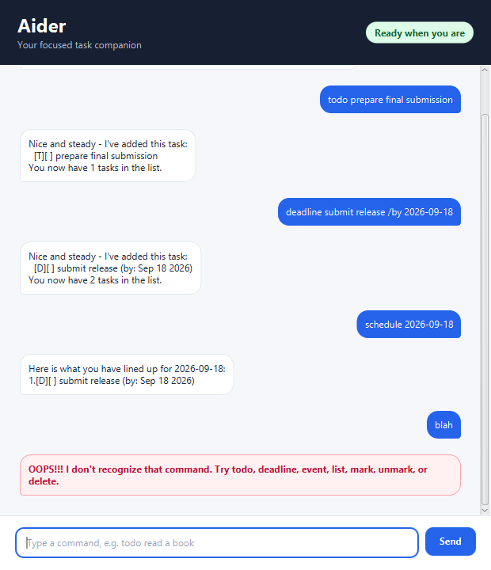

# Aider



Aider is a calm, encouraging task companion for keeping everyday work organised.
It supports simple tasks, deadlines, events, search, schedules, and progress updates
through a friendly command-line and desktop interface.

## Quick start

Use Java 25 and run the desktop application with Gradle:

```text
./gradlew run
```

Type a command in the input box and press **Send**. Aider keeps your tasks in
`data/aider.txt` so they are available the next time you launch the app.

## Features

### Add tasks

Create a simple task with `todo`:

```text
todo prepare presentation
```

Add a deadline with a supported date or date-time:

```text
deadline submit report /by 2026-09-18
```

Add an event with a start and end time:

```text
event project meeting /from 2026-09-18 1400 /to 2026-09-18 1530
```

### Manage tasks

```text
list
mark 1
unmark 1
delete 1
```

Aider prevents duplicate tasks and explains invalid task numbers or malformed
commands without ending the session.

### Find and schedule

Search task descriptions with:

```text
find report
```

View deadlines and events matching their original date or time text with:

```text
schedule 2026-09-18
```

Use `on yyyy-MM-dd` to view deadlines and events occurring on a calendar date.

### Helpful error handling

Aider highlights errors in the desktop interface and reports them clearly in the
console. It handles missing data files, malformed saved entries, invalid dates,
repeated command markers, duplicate tasks, and unsafe storage paths gracefully.

## Exiting

Enter:

```text
bye
```

Aider saves changes as commands are completed and responds with a friendly goodbye.
